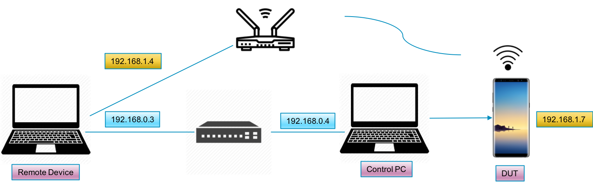

# Automated_Iperf
Building Iperf server/client and measuring a throughput automatically with a logging

## Summary
Iperf is a tool for throughput measurements on IP networks especially TCP, UDP bandwidth. If you are not familiar with Iperf tool, please refer to the link below.
[link to Iperf GitHub!](https://github.com/esnet/iperf)

Iperf is currently widely used in Wireless communication in order to measure maximum througputs between AP and stations or peer devices. For examples, the througputs will be decreasing as the stations is moving away from a connected AP. This can be evaluated through RvR measurement, which measure the througput as RSSI, Received Signal Strength Indicatior, decrease or the distance from a connected device increase. Iperf is a tool used for this througput measurement.

To run iperf, we need to set up iperf server and client at host and client side.
you can confing manyally options and run server and client respectively, but it is a little trouble some to do.

This automated Iper setup and running scripts which is made by Python can help you config iperf server and clinet, start automatically, and loggging that you want to collect in your control PC. 
It doesn't require extra hands to sync the time between Server and Clent. 

Also, it is useful for getting logs that needs time sync between server and client. 

## Iperf Throughput Automatic Running Configuration
The following picture is describing the overall configuration of iperf auto measurement.

Iperf server will be running on the server pc, remote device and client will be running on DUT or vice versa. It depends on your configuration on what the server/client will be.
Anyway, the remote device and DUT are connected via the AP here, it is a wireless connection. so the iperf will measure a wireless throughput between a remote pc and DUT.

The control pc control all programs which will be running on the server side and client side. It will also collect the logs from server and client at the same time. It is connected via IP hub which is connected with a remote pc.

* Control PC
  * Server (Remote PC), Client (DUT)
    * Set iperf server to PC and client to DUT
    * Running iperf as a server through remote commands using "sshpass
      exec sshpass -p 'password' ssh -o StrictHostKeyChecking=no 'userid'@remote_ip.address commands shell=True"
    * Run iperf client on DUT via 'adb shell' command
    * Extracting logs from remote pc using proc.stdout.readline()
  * Server (DUT), Client (Remote PC)
    * Same as the above except changing the server, client and commands

                        
The AP distribute IP address two connected devices, 192.168.1.x and 192.168.1.x1 respectively. It is different from ip addresses distributed to a remote device and control pc from a ip router.

# Usage

**python iperf_auto.py [options]** 
 
usage: iperf_auto.py [-h] [-ipd IPD_ADDRESS] [-ipp IPP_ADDRESS] [-t TCP_UDP] 
                       [-d DURATION] [-x DIRECTION] [-b BAND] [-lc LOCAL_TYPE]
                       [-s SLEEP_TIME] 
 
**optional arguments:** 
  -h, --help            show this help message and exit 
  -ipd IPD_ADDRESS, --ipd_address IPD_ADDRESS dut ip address 
  -ipp IPP_ADDRESS, --ipp_address IPP_ADDRES peer device ip address 
  -t TCP_UDP, --tcp_udp TCP_UDP tcp or udp 
  -d DURATION, --duration DURATION duration 
  -x DIRECTION, --direction DIRECTION directon 'tx' or 'rx'                    
  -b BAND, --band BAND  band a(5GHz) or b(2.4GHz) 
  -lc LOCAL_TYPE, --lc_type LOCAL_TYPE local dut device is 'LOCAL'(PC) or 'PHONE'                
  -s SLEEP_TIME, --sleep SLEEP_TIME (sec)
                        Sleep duration between wl commands, need to adjust for your logging.  
 
 Typical usage for this is to collect wl counters values every 1 second while running iperf. Also, you can record iperf througputs. 
 
For examples, with configuration described above, you can assign -ipd to '192.168.1.7', -ipp '192.168.1.4'. The options -x indicate direction dut perspective so if you want to measure tcp rx throughput on the phone dut, you can set lie this
-t tcp -x rx -lc PHONE. In this case, iperf will be running as a server on the rempote PC and iperf client will be running as a client on the phone(DUT).
-b, band informaton is needed to set sleep time as it varys depend on 2.4GHz or 5GHz a little bit.
 
**iperf_auto.py -ipd 192.168.1.7 -ipp 192.168.1.4 -b a -t tcp -x rx -lc PHONE -d 60 -s 0.8**

